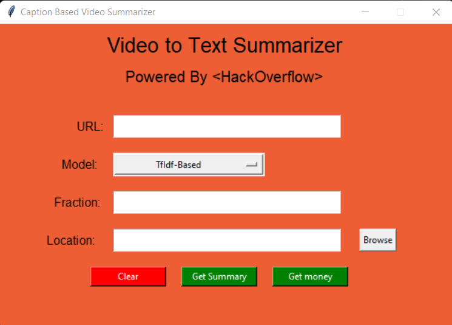

<h1 align="center"> YouTube-Summarizer</h1>

## Problem Statement

The Covid Pandemic has changed many of our ways including how newer generations are getting educated; watching hour long recorded lecture videos, trying their best to grasp concepts but failing to do so efficiently. 

## Objective

Our time efficient solution revolves around AI technologies like Natural Language Processing and Machine Learning by summarizing the video content into a text passage to greatly improve the learning experience of the user whilst consuming their least possible time, bringing all of this to an easy to use user-friendly interface.

## Process

* Get the English Trasncript from the user given YouTube link
* Remove all the time stamps and clean it and store in one text document
* Run the NLP text summarization algorithm on the given document
* Set the location for the summary to be saved in
* Develop a GUI for the same

## Working

## Future Work

- Allow support for Udemy and other such educational websites
- Process entire playists and save in separate files
